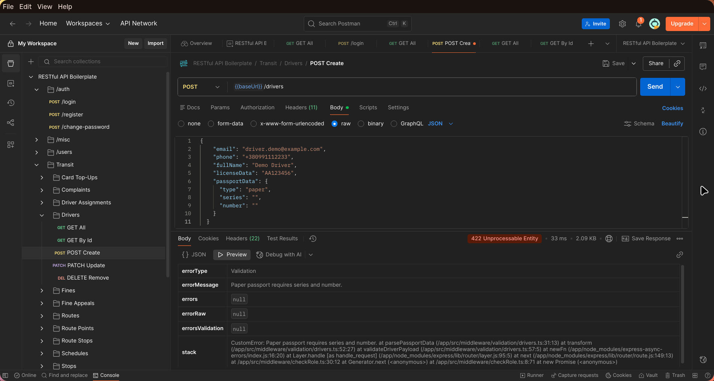
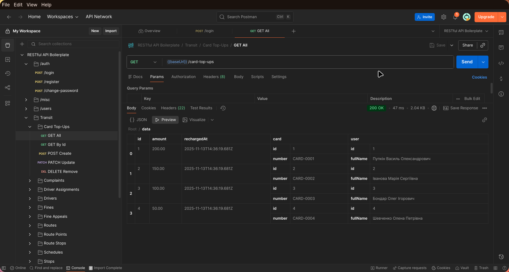

# TypeORM / Express / TypeScript RESTful API boilerplate

[![CI][build-badge]][build-url]
[![TypeScript][typescript-badge]][typescript-url]
[![prettier][prettier-badge]][prettier-url]


Boilerplate with focus on best practices and painless developer experience:

- Minimal setup that can be extended 🔧
- Spin it up with single command 🌀
- TypeScript first
- RESTful APIs
- JWT authentication with role based authorization

## Requirements

- [Node v16+](https://nodejs.org/)
- [Docker](https://www.docker.com/)

## Running

_Easily set up a local development environment with single command!_

- clone the repo
- `npm run docker:dev` 🚀

Visit [localhost:4000](http://localhost:4000/) or if using Postman grab [config](/postman).

## Domain (Workshop 5)

- Transit domain with users (TRANSIT, DISPATCHER, ADMINISTRATOR) and auth; transport types → routes → route stops/points → schedules/vehicles → trips.
- Vehicles belong to a transport type and route; drivers are bound to vehicles via driver assignments.
- Trips link a route, vehicle and driver and have tickets, fines, fine appeals and complaints.
- Transit users hold transport cards with top-ups; both transit users and vehicles have GPS logs.
- All entities are created via migrations (`src/orm/migrations/1762785696596-CreateTransitEntities.ts`) and seeded (`src/orm/seeds/1763044144522-TransitSeed.ts`).

## API endpoints (v1)

- Auth: `POST /v1/auth/login`, `POST /v1/auth/register`, `POST /v1/auth/change-password`
- Users: `GET /v1/users`, `GET /v1/users/:id`, `POST /v1/users/dispatchers`, `PATCH /v1/users/:id`, `DELETE /v1/users/:id`
- Transport types: `GET/POST/PATCH/DELETE /v1/transport-types`
- Routes (with transport type, stops, points, vehicles, schedule): `GET/POST/PATCH/DELETE /v1/routes`
- Route stops: `GET/POST/PATCH/DELETE /v1/route-stops`; Route points: `GET/POST/PATCH/DELETE /v1/route-points`
- Stops: `GET/POST/PATCH/DELETE /v1/stops`; Schedules: `GET/POST/PATCH/DELETE /v1/schedules`
- Vehicles: `GET/POST/PATCH/DELETE /v1/vehicles`; Driver assignments: `GET/POST/PATCH/DELETE /v1/driver-assignments`; Drivers: `GET/POST/PATCH/DELETE /v1/drivers`
- Trips: `GET/POST/PATCH/DELETE /v1/trips` (route + vehicle + driver join)
- Transport cards: `GET/POST/PATCH/DELETE /v1/transport-cards`, `GET /v1/transport-cards/me`; Card top-ups: `GET/POST/PATCH/DELETE /v1/card-top-ups`
- Tickets: `GET/POST/PATCH/DELETE /v1/tickets`; Fines: `GET/POST/PATCH/DELETE /v1/fines`; Fine appeals: `GET/POST/PATCH/DELETE /v1/fine-appeals`; Complaints: `GET/POST/PATCH/DELETE /v1/complaints`
- GPS logs: `GET/POST/PATCH/DELETE /v1/user-gps-logs`, `GET/POST/PATCH/DELETE /v1/vehicle-gps-logs`

## Postman evidence

- Validation failure example (middleware blocks malformed payload): `docs/screenshots/workshop-6/validation-error.png`
- Successful response with joined relations (DTO in reply): `docs/screenshots/workshop-6/success-response.png`

### _What happened_ 💥

Containers created:

- Postgres database container seeded with 💊 Breaking Bad characters in `Users` table (default credentials `user=walter`, `password=white` in [.env file](./.env))
- Node (v16 Alpine) container with running boilerplate RESTful API service
- and one Node container instance to run tests locally or in CI

## Features:

- [Express](https://github.com/expressjs/express) framework
- [TypeScript v4](https://github.com/microsoft/TypeScript) codebase
- [TypeORM](https://typeorm.io/) using Data Mapper pattern
- [Docker](https://www.docker.com/) environment:
  - Easily start local development using [Docker Compose](https://docs.docker.com/compose/) with single command `npm run docker:dev`
  - Connect to different staging or production environments `npm run docker:[stage|prod]`
  - Ready for **microservices** development and deployment.  
    Once API changes are made, just build and push new docker image with your favourite CI/CD tool  
    `docker build -t <username>/api-boilerplate:latest .`  
    `docker push <username>/api-boilerplate:latest`
  - Run unit, integration (or setup with your frontend E2E) tests as `docker exec -ti be_boilerplate_test sh` and `npm run test`
- Contract first REST API design:
  - never break API again with HTTP responses and requests payloads using [type definitions](./src/types/express/index.d.ts)
  - Consistent schema error [response](./src/utils/response/custom-error/types.ts). Your frontend will always know how to handle errors thrown in `try...catch` statements 💪
- JWT authentication and role based authorization using custom middleware
- Set local, stage or production [environmental variables](./config) with [type definitions](./src/types/ProcessEnv.d.ts)
- Logging with [morgan](https://github.com/expressjs/morgan)
- Unit and integration tests with [Mocha](https://mochajs.org/) and [Chai](https://www.chaijs.com/)
- Linting with [ESLint](https://eslint.org/)
- [Prettier](https://prettier.io/) code formatter
- Git hooks with [Husky](https://github.com/typicode/husky) and [lint-staged](https://github.com/okonet/lint-staged)
- Automated npm & Docker dependency updates with [Renovate](https://github.com/renovatebot/renovate) (set to patch version only)
- Commit messages must meet [conventional commits](https://www.conventionalcommits.org/en/v1.0.0/) format.  
  After staging changes just run `npm run commit` and get instant feedback on your commit message formatting and be prompted for required fields by [Commitizen](https://github.com/commitizen/cz-cli)

## Workshop 6 Architecture (services+ validation + DTO)

To keep controllers slim we introduced three explicit layers:

- **Middleware validation** – e.g. `src/middleware/validation/trips.ts` trims/normalises IDs, converts dates and rejects invalid payloads _before_ a controller executes.
- **Controllers** – request orchestration only. They create a service instance, pass already validated data, and shape the HTTP response.
- **Services** – all business logic and repository access (TypeORM) live here. Every entity has a single service (`src/services/**`) that hides persistence details from controllers.
- **Repositories/DataSource** – managed solely by services through `getRepository`, keeping data access isolated.

### Example middleware

```ts
// src/middleware/validation/trips.ts
export const validateTripPayload = (req, _res, next) => {
  req.body.routeId = parseId(req.body.routeId, 'Route id');
  req.body.vehicleId = parseId(req.body.vehicleId, 'Vehicle id');
  req.body.driverId = parseId(req.body.driverId, 'Driver id');
  req.body.startedAt = parseDate(req.body.startedAt, 'Started at');
  req.body.endedAt = parseDate(req.body.endedAt, 'Ended at');
  if (req.body.endedAt <= req.body.startedAt) {
    throw new CustomError(422, 'Validation', 'Ended at must be greater than started at.');
  }
  req.body.passengerCount = parsePassengerCount(req.body.passengerCount);
  return next();
};
```

### Example DTO + service

```ts
// src/dto/stops/StopResponseDTO.ts
export class StopResponseDTO {
  constructor(stop: Stop) {
    this.id = stop.id;
    this.name = stop.name;
    this.latitude = stop.latitude;
    this.longitude = stop.longitude;
    this.routeStops =
      stop.routeStops?.map((routeStop) => ({
        id: routeStop.id,
        route: routeStop.route
          ? {
              id: routeStop.route.id,
              number: routeStop.route.number,
              direction: routeStop.route.direction,
              transportType: routeStop.route.transportType
                ? { id: routeStop.route.transportType.id, name: routeStop.route.transportType.name }
                : null,
            }
          : null,
      })) ?? [];
  }
}
```

```ts
// src/services/stops/StopService.ts
export class StopService {
  private stopRepository = getRepository(Stop);

  public async create(payload: StopPayload): Promise<Stop> {
    const stop = this.stopRepository.create(payload);
    const saved = await this.stopRepository.save(stop);
    return this.findOneOrFail(saved.id);
  }

  public async delete(id: string): Promise<void> {
    const deleteResult = await this.stopRepository.delete(id);
    if (!deleteResult.affected) {
      throw new CustomError(404, 'General', `Stop with id:${id} not found.`);
    }
  }
}
```

### Postman flows

- **Validation error** (middleware rejects malformed payload):  
  
- **Successful DTO response** (controller returns DTO-wrapped entity):  
  

## Other awesome boilerplates:

Each boilerplate comes with it's own flavor of libraries and setup, check out others:

- [Express and TypeORM with TypeScript](https://github.com/typeorm/typescript-express-example)
- [Node.js, Express.js & TypeScript Boilerplate for Web Apps](https://github.com/jverhoelen/node-express-typescript-boilerplate)
- [Express boilerplate for building RESTful APIs](https://github.com/danielfsousa/express-rest-es2017-boilerplate)
- [A delightful way to building a RESTful API with NodeJs & TypeScript by @w3tecch](https://github.com/w3tecch/express-typescript-boilerplate)

[build-badge]: https://github.com/mkosir/express-typescript-typeorm-boilerplate/actions/workflows/main.yml/badge.svg
[build-url]: https://github.com/mkosir/express-typescript-typeorm-boilerplate/actions/workflows/main.yml
[typescript-badge]: https://badges.frapsoft.com/typescript/code/typescript.svg?v=101
[typescript-url]: https://github.com/microsoft/TypeScript
[prettier-badge]: https://img.shields.io/badge/code_style-prettier-ff69b4.svg
[prettier-url]: https://github.com/prettier/prettier

## Contributing

All contributions are welcome!
